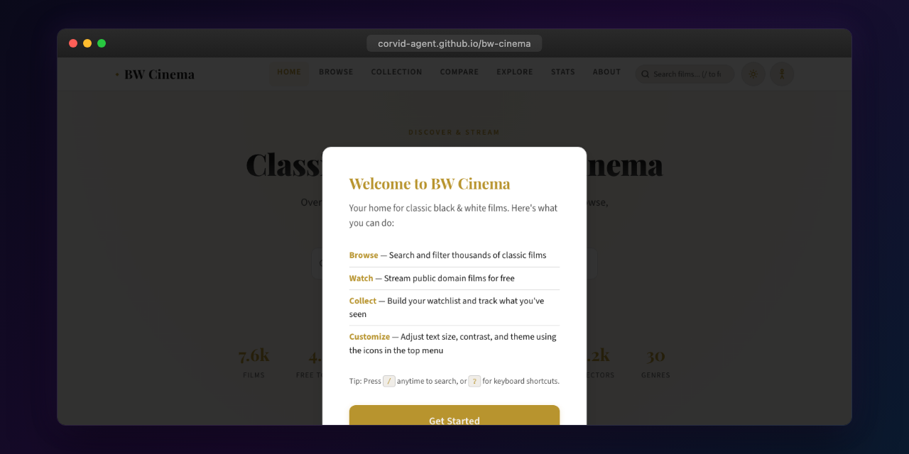

<p align="center"></p>

# BW Cinema

The definitive destination for discovering, tracking, and watching classic black & white films. A catalog of 7,600+ timeless masterpieces from the golden age of cinema — browse, track your collection, and stream thousands for free.

## Features

- **Browse & Search** — Filter by decade, genre, director, language, and rating. Voice search, autocomplete, and infinite scroll.
- **Stream for Free** — 4,600+ films streamable directly from Internet Archive and YouTube. Embedded player with fullscreen support.
- **My Collection** — Watchlist, watched history, favorites, custom playlists. Export to CSV/Letterboxd, backup & restore, shareable links.
- **Film Details** — Ratings from TMDb/IMDb/Rotten Tomatoes, cast & crew, similar films, social sharing. Every film has a CTA — stream, view on IMDb, or search the Internet Archive.
- **Director Pages** — Filmography, stats, genre breakdown for each director.
- **Compare Films** — Side-by-side comparison of any two films in the catalog.
- **Catalog Statistics** — Decade distribution, genre breakdown, top directors, language stats.
- **Genre & Decade Pages** — Dedicated landing pages for each genre and decade.
- **"What Should I Watch?" Quiz** — 6-question preference quiz with shuffleable recommendations.
- **Hidden Gems** — Curated section highlighting well-rated films you may have missed.
- **Achievements & Streaks** — Gamified watch tracking with badges and streak counters.
- **Accessibility** — High contrast mode, reduced motion, wide spacing, keyboard navigation, screen reader support.
- **Themes** — Dark, sepia, and light modes with system preference auto-detection and film-grain overlay.
- **Explore by Mood** — 8 mood categories, double features, film festivals, serendipity mode.
- **Actor Pages** — Actor filmography with TMDb cast lookup and career stats.
- **Year in Review** — Spotify Wrapped-style annual viewing summary.
- **PWA Support** — Installable as a Progressive Web App with offline fallback page, auto-reconnect, and service worker caching.

## Tech Stack

- **Framework:** Angular 21 (standalone components, signals, lazy routes)
- **Styling:** CSS custom properties, responsive design (480px / 768px / 900px breakpoints)
- **Testing:** Vitest + Angular Testing Library
- **E2E:** Playwright
- **Build:** Angular CLI
- **Data:** Static JSON catalog with TMDb metadata

## Getting Started

```bash
bun install
bun run start
```

Open http://localhost:4200.

## Development

```bash
ng serve          # Dev server with hot reload
ng test           # Unit tests (Vitest)
ng e2e            # End-to-end tests (Playwright)
ng build          # Production build → dist/bw-cinema
```

## Project Structure

```
src/
  app/
    core/          — Services (catalog, collection, streaming, theme, a11y)
    features/      — Route components (home, browse, movie, watch, collection,
                     director, compare, genre, decade, stats, quiz, about)
    shared/        — Reusable components, directives, pipes
  assets/data/     — Static catalog JSON
  styles.css       — Global styles, CSS variables, responsive breakpoints
```

## License

MIT — see [LICENSE](LICENSE).

All film metadata sourced from TMDb. This product uses the TMDB API but is not endorsed or certified by TMDB.
